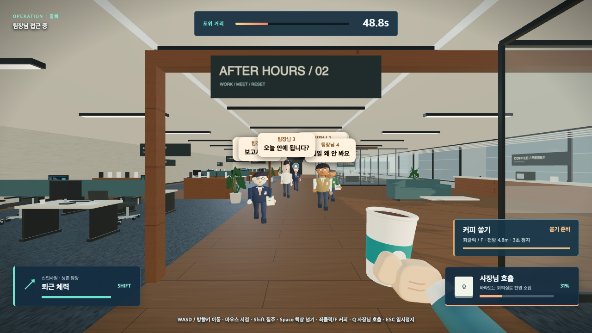
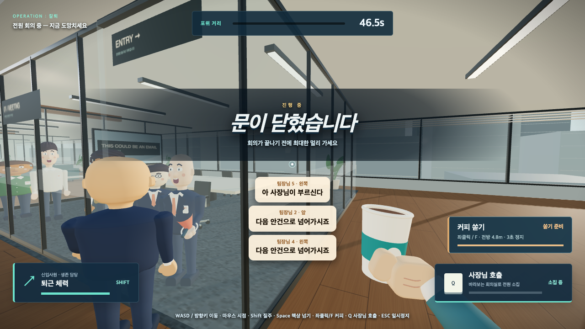
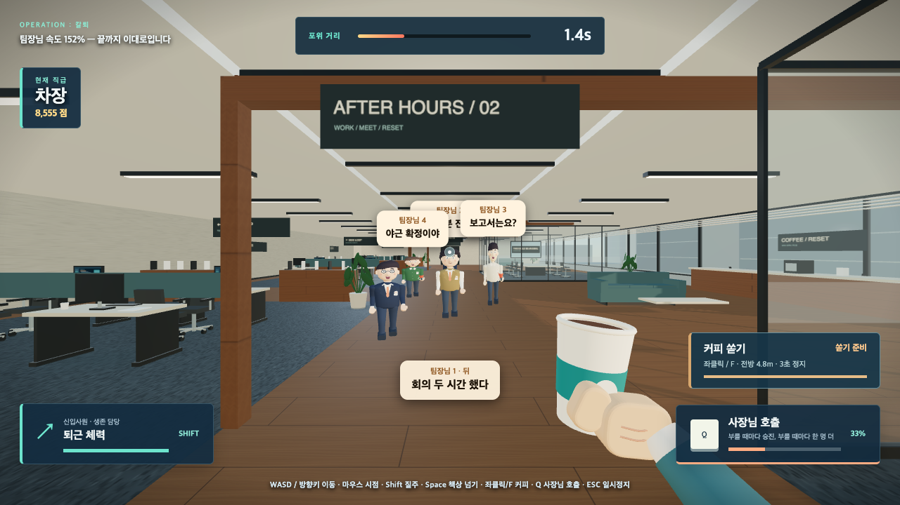
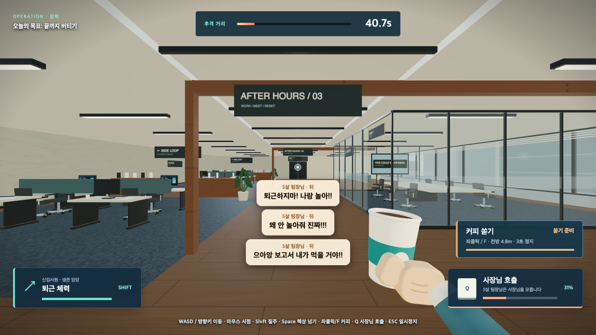

# 팀장님이 온다

**[▶ 지금 바로 플레이 — boss-or-baby.vercel.app](https://boss-or-baby.vercel.app/)**

설치 없음. 로그인 없음. 합격 메일로 시작하는 악몽 속 사무실 탈출기. PC 브라우저 권장.

> ⚠ 사내 위험 알림 ⚠
> 업무는 끝났다. 추격은 이제 시작이다.



## 어떤 게임인가

긴 취업 준비 끝에 작은 회사에 합격했습니다. 그런데 팀장님은 다섯, 일할 사람은 나 하나. 과로 끝에 잠든 밤, 꿈에서도 팀장님들이 쫓아옵니다. “너 없으면 회사가 안 돌아가.”

1인칭 시점으로 사무실을 뛰어다니며 팀장님을 피하는 도주 게임입니다. 접수대와 라운지, 카펫이 깔린 업무 구역 넷, 유리 회의실 둘, 창가 팬트리로 이어지는 한 층이 무대입니다. 끝까지 살아남으면 칼퇴, 붙잡히면 그대로 결과 화면입니다.

당신은 신입이고 가진 건 식은 커피 한 잔뿐입니다. 하지만 팀장님 위에는 사장님이 있습니다. 이 게임의 필살기는 권력을 쓰는 게 아니라 더 큰 권력을 빌리는 것이고, 빌린 권력에는 이자가 붙습니다.

정해진 시간을 버티는 모드가 둘, 시간 제한 없이 어디까지 올라가는지 겨루는 모드가 하나입니다. 한 판은 1분 안팎이라 점심시간에 몇 판 돌릴 수 있습니다.

## 1인칭 프롤로그 — 내 자리에서 시작하는 악몽

게임을 켜면 야근 책상을 배경으로 한 시작 화면이 나타납니다. 이름을 입력하고 **시작하기**를 누르면 암전 뒤 주인공의 눈높이로 노트북 앞에 앉습니다. 처음에는 평범한 받은메일함이 보이고, E로 새로고침하면 합격 메일이 `NEW` 강조와 함께 도착하며, 다시 E를 누르면 본문이 열립니다. 입력한 이름은 합격 메일의 수신자와 첨부파일, 사원증, 보고서 작성자, 팀장 대사와 본게임 HUD에 이어지며 다시 보기에서도 유지됩니다. 시작하기 전에는 이야기 시간이나 이동 입력이 진행되지 않습니다. 합격 메일을 확인하고, 첫 출근 날 안내 데스크로 걸어가 사원증을 받습니다. 눈앞의 다섯 팀장이 일을 맡기고, 같은 책상에서 야근하다 잠깐 눈을 붙이면 회사가 악몽으로 바뀝니다. 마지막에는 직접 내선 전화로 사장님을 부르며 반격을 결심합니다.

- **화면 클릭 + 마우스**로 시점을 돌립니다. 드래그로 둘러보기도 지원합니다. **ESC**로 마우스를 해제합니다.
- 서 있는 장면에서는 **WASD**로 걷습니다. 앉아서 메일을 읽거나 전화하는 장면은 자리에서 둘러봅니다.
- 대상에 가까이 가서 바라보면 **E**로 상호작용합니다. 대사가 남아 있으면 E로 이어 듣고, 마지막 대사 뒤에 행동합니다.
- **R**로 문서를 확대해 자세히 볼 수 있습니다. 합격 메일의 입사 안내·첨부파일, 팀장별 야근 메일, 사원증과 결재란이 있는 보고서를 직접 디자인했습니다.
- 이야기는 짧은 하단 자막으로 전달합니다. 큰 소개 패널이나 장면 넘기기 버튼은 없습니다.
- 상단에서 건너뛰거나 소리를 켤 수 있습니다. 끝나면 세 모드 중 악몽을 선택하며, 모드 선택에서 다시 보기도 가능합니다.
- 동작 줄이기 설정을 존중하며, 프롤로그를 나가면 전용 렌더러·오디오·마우스 잠금을 해제합니다. 실제 추격 게임의 규칙과 조작은 그대로입니다.

## 세 가지 모드

**5살 팀장님** — 키는 줄었는데 직급은 그대로입니다. 한 명뿐이지만 제일 빠르고, 떼쓰면서 쫓아옵니다. 42초를 버티면 승리.

**팀장님 5명** — 사무실 곳곳에서 다섯이 동시에 따라붙습니다. 한 명을 피하다 다른 한 명과 정면으로 마주치는 게 이 모드의 사인입니다. 50초를 버티면 승리.

**야근 모드** — 시간 제한이 없습니다. 승리도 없습니다. 사장님을 부를 때마다 승진하고, 승진할 때마다 점수가 쌓이는 속도가 가팔라지는 대신 쫓는 사람이 한 명씩 늘어납니다. 사원에서 시작해 어디까지 올라가는지가 전부입니다.

시작 전에 상대를 직접 빚습니다. 인상 5종, 헤어 5종, 표정 4종, 소품 5종, 피부 4종, 옷 5종. 5명 모드에서는 다섯을 각각 따로 꾸미고, 5살 모드는 유치원복으로 고정입니다. 당신을 쫓아올 얼굴은 당신이 고릅니다.

## 조작

| 키 | 동작 |
|---|---|
| W / A / S / D, 방향키 | 이동 |
| 마우스 | 시점 회전 |
| Shift | 질주 (체력 소모) |
| Space | 점프, 책상 위로 올라타기 |
| 좌클릭 또는 F | 커피 쏟기 |
| Q | 사장님 호출 |
| Esc | 일시정지 |
| R | 시점 정면으로 초기화 |

화면을 클릭하면 마우스가 잠기고 추격과 타이머가 함께 시작됩니다. 시점을 어느 방향으로 돌려도 W는 언제나 바라보는 방향입니다. 위아래를 봐도 이동 속도는 변하지 않습니다.

### 커피 쏟기

전방 4.8미터 원뿔 안의 팀장님을 3초간 멈춥니다. 5.5초마다 다시 씁니다. 유리벽 너머로는 안 날아갑니다. 조준이 필요한 대신 자주 쓸 수 있는 기본기입니다.

커피를 붓는 소리와 명중·빗나감 소리가 따로 재생됩니다. 게임 안에서는 발걸음, 질주 바람, 점프와 착지, 가까운 추격자의 심박 경고, 사내 방송 차임, 회의실 문, 승진, 추격 속도 상승과 승패에도 각각 다른 효과음이 납니다. 우측 상단 버튼이나 **M**으로 전체 인게임 소리를 끌 수 있습니다.

### 사장님 호출 — 궁극기



게이지가 다 차면 사내 방송이 나가고 사장님이 직접 나타납니다. 결과는 모드마다 다릅니다.

**5명 모드** — 팀장님들은 사장님이 누군지 정확히 압니다. 추격을 버리고 당신이 바라보는 회의실로 뛰어 들어가 줄지어 섭니다. 사장님이 문 앞에 서고, 문이 닫힙니다.

**5살 모드** — 다섯 살은 사장님이 누군지 모릅니다. "안경 내놔!!" 하면서 달려들고, 사장님은 복도 반대편으로 도망칩니다. 둘이 붙어 있는 동안이 당신의 시간입니다.

- **조준해서 씁니다.** 5명 모드에서는 바라보는 쪽 회의실로 소집됩니다. 엉뚱한 방향을 보고 누르면 그쪽으로 전부 몰려옵니다.
- **발동 중에는 붙잡히지 않습니다.** 끝날 때까지가 도망칠 시간입니다.
- **대가가 영구적입니다.** 끝나고 나온 팀장님은 남은 시간 내내 더 빠릅니다. 한 번 부를 때마다 1.35배씩 누적되고 2.2배에서 멈춥니다.
- **게이지는 위험할수록 빨리 찹니다.** 등 뒤에 바짝 붙었을 때 가장 빠르게 충전됩니다.

야근 모드에서는 같은 버튼이 승진 버튼이 됩니다. 사원, 대리, 과장, 차장, 부장, 이사, 사장 순으로 올라가고 직급이 오를수록 점수가 가파르게 쌓입니다. 대신 한 명이 더 붙고 전원이 영구히 빨라집니다. 여기서는 속도 상한이 없습니다.

한 번도 안 부르고 버티는 전략은 통하지 않습니다. 사원 점수로는 아무리 오래 살아도 순위에 못 듭니다. 그렇다고 연속으로 부르면 이사까지 갔다가 금방 잡힙니다. 각 직급에서 얼마나 버티다 올라갈지가 이 모드의 전부입니다.

## 야근 모드 — 승진할수록 위험해집니다



사장님을 안 부르면 사실 잡히지 않습니다. 팀장님은 걷는 속도보다 느리거든요. 그래서 야근 모드에서 이 게임을 끝나게 만드는 건 사장님 호출뿐이고, 점수를 올리는 것도 사장님 호출뿐입니다.

야근 모드에서는 실내 천장등과 업무 공간은 밝게 유지되지만 창밖은 별과 초승달, 어두운 건물과 켜진 창문이 보이는 밤으로 전환됩니다. 다른 모드로 돌아가면 낮 환경으로 복구됩니다.

버티기만 하는 사람은 오래 살아도 사원으로 끝납니다. 욕심내는 사람은 이사까지 갔다가 금방 잡힙니다. 그 사이 어딘가가 정답입니다.

## 앞만 보고 달려도 다 들립니다



팀장님들은 쫓아오면서 끊임없이 떠듭니다. 보고서는요, 오늘 안에 됩니다, 메일 왜 안 봐요.

문제는 도망치는 게임이라 그 얼굴이 늘 등 뒤에 있다는 겁니다. 그래서 보이는 상대의 대사는 머리 위 말풍선으로, 화면 밖 상대의 대사는 화면 아래 자막으로 나뉘어 표시됩니다. 자막에는 누가 어느 쪽에서 하는 말인지 방향이 붙습니다. 앞만 보고 달려도 뒤에서 뭐라고 하는지 다 읽힙니다.

## 만들게 된 사연

원래 잡코리아 바이브톤에 **"팀장님만 보면 한숨 나오는 서비스"**라는 주제로 내보려고 혼자 뚝딱뚝딱 만들어본 프로젝트입니다. 그런데 정작 바이브톤 선정에서는 미끄러졌습니다. 팀장님한테 쫓기는 것도 서러운데 선정에서도 도망쳐버리다니.

만들어놓은 게 아까워서, 그리고 도망치는 재미는 진짜 있어서, 혼자 접어두기엔 아쉬워 이렇게 올립니다.

## 알아두면 좋은 것

- PC 브라우저용입니다. 모바일 터치 조작은 지원하지 않습니다.
- 마우스 시점 잠금 때문에 HTTPS가 필요합니다. 위 링크로 접속하면 그대로 됩니다.
- Three.js를 CDN에서 받아오므로 첫 실행에 인터넷 연결이 필요합니다.

---

## 개발자를 위한 메모

빌드 도구도, 패키지 설치도, 서버도 없습니다. 정적 파일 한 묶음이 전부입니다.

```bash
git clone https://github.com/qkrwlgus89/Boss-or-Baby-.git
cd Boss-or-Baby-
python3 -m http.server 8080
```

이후 `http://localhost:8080` 접속. Pointer Lock API 때문에 `file://`로 직접 여는 것보다 로컬 서버를 권합니다.

### 기술 스택

[Three.js](https://threejs.org/) r0.155.0 (CDN) 위에 순수 JS / HTML / CSS.

### 파일 구조

| 파일 | 역할 |
|---|---|
| `index.html` | 타이틀·모드선택·커스터마이징·게임·결과 화면 UI 전체 |
| `intro-art.js` | 합격 메일·야근 메일함·사원증·보고서·전화 LCD의 고해상도 캔버스 디자인 |
| `intro.js` / `intro.css` | 1인칭 스토리, 걷기·시점·거리/시선 상호작용·자막·전환 |
| `character.js` | 팀장님 3D 캐릭터 빌더, 절차적 조형과 관절 애니메이션 |
| `world.js` | 오피스 맵 빌더와 충돌 데이터 |
| `movement.js` | 시점 기준 이동, 프레임 독립 가감속, 체력 |
| `traversal.js` | 점프와 가구 위 착지 등 높이 처리 |
| `navigation.js` | 공유 역방향 경로 탐색과 반경을 고려한 시야 검사 |
| `coffee.js` | 커피 쏟기의 원뿔 판정과 시야 차단 |
| `summon.js` | 사장님 호출의 게이지·회의실 조준·소집 단계 |
| `rank.js` | 야근 모드의 직급 사다리, 점수 계산, 난이도 상승 |
| `game-audio.js` | 발걸음·커피·호출·회의·속도 상승·승진·승패의 Web Audio 효과음 |
| `game3d.js` | 화면 전환, 커스터마이징 미리보기, 1인칭 컨트롤, 추격 AI, HUD |

`assets/characters/`의 인체 메시 데이터는 이전 버전이 쓰던 것으로, 현재 `index.html`은 불러오지 않습니다. 출처 기록을 위해 저장소에 남겨두되 배포에서는 제외합니다 ([출처·CC0·변경 내역](assets/NOTICE.md)).

### 만들면서 신경 쓴 것

- 시점 기준 이동, 짧은 가감속, 대각선 속도 정규화, 프레임 속도에 독립적인 이동량
- 벽 미끄러짐과 작은 이동 단계로 터널링 없는 충돌 처리
- 질주 시 작은 FOV 변화와 수평을 유지하는 카메라
- 절차적으로 조형한 얼굴·머리·의상, 곡면을 따라가는 셔츠와 라펠, 팔꿈치·무릎 애니메이션
- 바닥·러그·접촉 음영을 서로 다른 높이에 배치해 카펫이 검게 일렁이던 z-fighting 제거
- 동일한 충돌 데이터를 쓰는 공유 경로 탐색. 적이 책상과 회의실 벽을 우회하고, 유리벽 너머에서는 붙잡지 않음
- 소집 중에는 같은 경로 탐색이 플레이어 대신 회의실 또는 사장님을 목표로 전환
- 타임드 모드는 난이도 상승에 상한이 있고, 야근 모드는 상한을 없애 승진 없이 버티는 전략을 차단
- 사장님은 막히면 앞을 더듬어 열린 방향으로 꺾음. 출구가 하나뿐인 회의실에서도 문을 찾아 나옴
- 건축물·의자·식물을 InstancedMesh로 묶어 드로콜 절감

### 테스트

이동·충돌·경로 탐색·능력 로직은 브라우저 없이 회귀 테스트로 돌립니다. Node.js만 있으면 됩니다.

```bash
node --test tests/movement.test.cjs tests/navigation.test.cjs tests/traversal.test.cjs tests/coffee.test.cjs tests/summon.test.cjs tests/rank.test.cjs
```

> `node --test tests/`처럼 디렉터리를 통째로 지정하면 Playwright가 필요한 `tests/browser.cjs`까지 실행하려다 실패합니다. 파일을 명시해서 돌리세요.

브라우저 통합 검사는 Playwright와 Chrome을 선택 설치해서 실행합니다. 게임 자체에는 필요 없습니다.

```bash
npm install --prefix /tmp/boss-baby-qa playwright
NODE_PATH=/tmp/boss-baby-qa/node_modules node tests/browser.cjs full
```

`full`은 커스터마이징 옵션 전수 선택, 실제 카메라 기준 이동 비교, 세 모드의 입력·궁극기·일시정지·패배·재시작·승리 전환, 대사 표시 분기, 야근 모드의 승진 사다리를 검사합니다. 기본 Chrome 경로는 macOS 기준이며 다른 환경에서는 `CHROME_PATH`와 `QA_OUTPUT`을 지정합니다. `visual`은 화면 캡처, `gallery`는 커스터마이징별 캡처, `perf`는 정지 장면의 렌더 처리량 측정입니다.

테스트 중 위치 배치와 타이머 경계값은 응답 가로채기로 브라우저 메모리에만 주입합니다. 배포 소스에는 디버그 조작 API가 없습니다. 실행 기록과 한계는 [검증 보고서](docs/qa/verification.md)를 참고하세요.

### 현재 표현 범위

도입부에는 목재·패브릭·벽 재질, 금속 환경 반사, 창밖 주야간 건물, 책상 조명과 접촉 음영, 곡면 모서리의 노트북·가구를 적용했습니다. 그래픽 검증은 Chrome/Apple M4 기준이며 상용 고예산 게임 수준을 보증하는 의미는 아닙니다.

캐릭터는 실행 시점에 코드가 조형합니다. 외부 인체 스캔이나 모션 캡처를 쓰지 않습니다. 상용 FPS의 스킨드 의상, 손가락 IK, 정교한 표정 리깅 수준은 아닙니다.

프롤로그 화면·상호작용 검증: `tests/intro-browser.cjs` (위 브라우저 테스트와 같은 Playwright 환경). [검증 기록](docs/qa/intro-verification.md).
