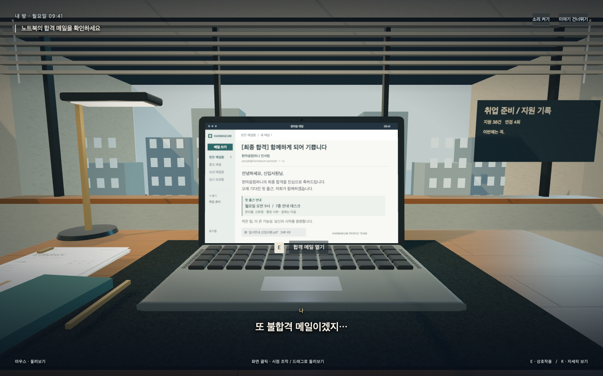
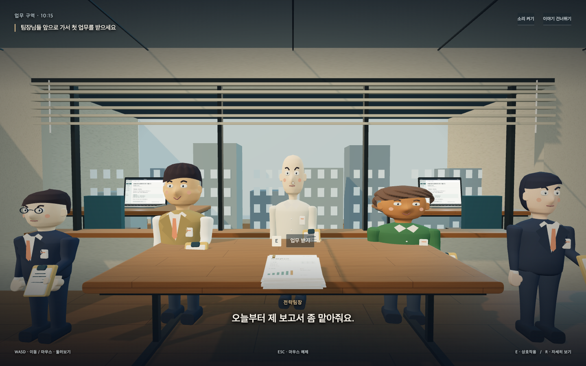
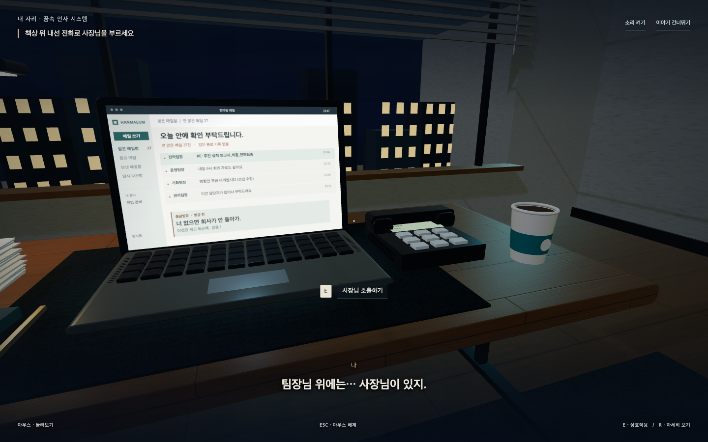
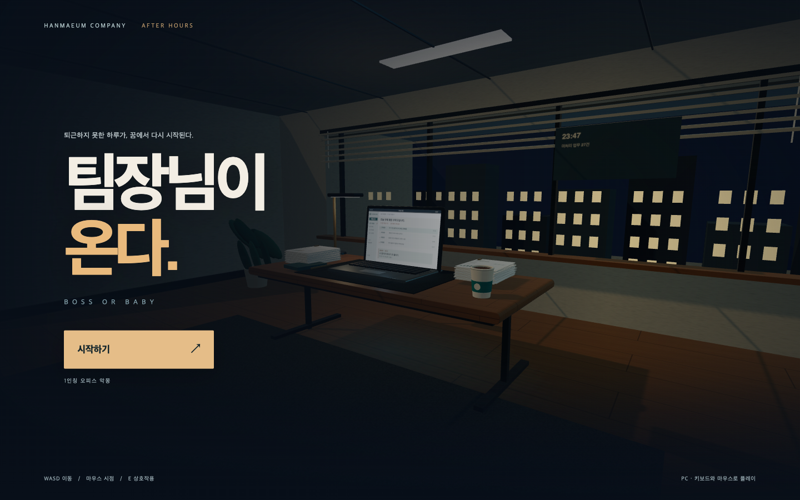
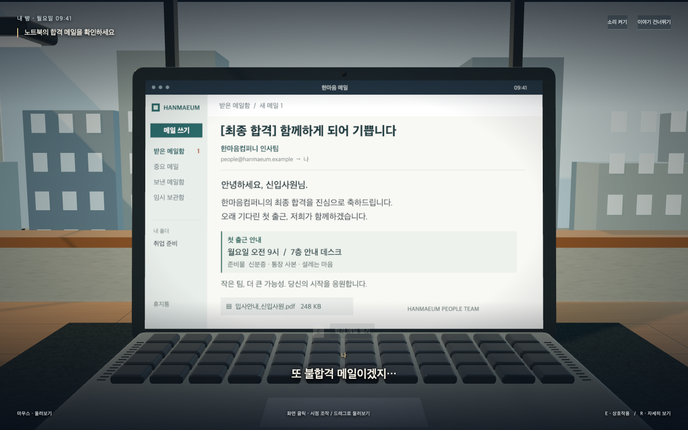

# 1인칭 스토리 검증

2026-09-24. 소개 화면 형태의 프롤로그를 실제 플레이어 눈높이의 도입부로 교체했다. 기존 로컬의 다른 변경과 게임 규칙은 유지했다. 커밋·배포는 하지 않았다.

## 구현

노트북 합격 메일 → 첫 출근/사원증 → 다섯 팀장의 지시 → 야근 → 같은 자리에서 악몽으로 깨어남 → 다가오는 팀장들 → 내선 전화로 사장님 호출. 총 7개 이야기 구간이다.

첫 구간은 자동 전환하지 않는다. 일반 받은메일함에서 E를 누르면 합격 메일이 최상단에 도착하고, 옅은 금색 배경·강조선·테두리·`NEW` 배지로 표시된다. 다시 E를 눌러야 개인화된 합격 메일 본문이 열린다.

시작 화면에서 플레이어 이름을 필수로 받는다. 앞뒤 공백과 제어문자를 정리한 최대 12자의 이름을 합격 메일 수신자·인사말·첨부파일명, 사원증, 보고서 작성자, 팀장의 호명, 자막 화자와 본게임 생존 카드에 동일하게 표시한다. 프롤로그 다시 보기에서도 현재 세션의 이름을 유지한다.

발표용 제목·조직도·승진 계단·다음/이전 버튼을 제거했다. 방 내부가 화면을 채우고, 목표와 짧은 대사만 HUD로 표시한다. 마우스 잠금/드래그 시점, WASD 이동, 거리와 바라보는 방향을 확인하는 E 상호작용을 구현했다. 대사는 읽을 시간을 주며 자동으로 이어지고 E로 넘길 수도 있다. 다음 구간은 명시적으로 상호작용해야 시작한다. 사원증을 받는 동작, 잠들 때 고개를 숙이는 동작, 전화 수화기를 드는 동작과 암전 전환을 넣었다.

앉아 있는 구간은 시점만 조작한다. 서 있는 구간은 지정된 동선 안에서 걷는다. 완전한 자유 탐색 캠페인은 아니다. 프롤로그가 끝나면 기존 모드 선택/커스터마이징으로 이어진다.

## 검증

- 내장 브라우저 연결은 `sandboxPolicy` 오류로 실패하여 로컬 Chrome + Playwright 사용.
- `tests/intro-browser.cjs`: 빈 이름의 시작 차단, 공백 정리, 이름의 프롤로그 다시 보기 및 본게임 HUD 유지와 함께 7개 구간을 실제 마우스·WASD·E로 진행하고 화면 촬영. 시점 변화, 사원증에 접근하기 전 상호작용 차단, 걸어서 접근 후 활성화, 대사 진행, 팀장들이 다가오는 동작, 완료 후 렌더러/마우스 잠금 해제, 다시 보기 초기화, 건너뛰기, 소리 토글, 동작 줄이기, 세 모드 커스터마이징 진입 통과. 도입부 종료 후 본게임에서 마우스 잠금·W 이동·ESC 시간 정지도 통과했다.
- 정상 실행 JS 예외 및 HTTP 오류 0건.
- 이동·충돌·경로·커피·사장님 호출·승진의 Node 회귀 테스트 33/33 통과.
- `node --check intro.js`, 새 브라우저 테스트 구문 검사와 `git diff --check` 통과.
- 이전 소개 화면 버전에서 수행했던 전체 게임 회귀 기록과 이번 1인칭 스토리 검증은 구분한다. 이번에는 새 시점·입력과 기존 모드 진입을 중심으로 검사했다.

## 화면 검토

1440×900 Chrome / Apple M4. 주인공 시점에서 노트북, 안내 데스크, 눈앞의 팀장들, 악몽 복도, 내선 전화를 직접 확인했다. 노트북 키보드의 과도하게 단순한 모양과 전화기/커피컵이 겹치던 배치를 수정했다.

## 한계

기존 절차적 캐릭터를 사용한다. 음성 더빙이나 손가락으로 물건을 집는 IK는 없다. 소리는 합성 배경음과 전환음이며 청감 평가는 포함하지 않았다. PC 키보드·마우스용으로 검증했고 다른 브라우저/GPU 및 모바일 조작은 검증하지 않았다.

## 시작 화면·그래픽 리빌드 후속 검증

- 시작하기 버튼이 있는 실시간 3D 메인 화면을 추가했다. 버튼 전에는 대사 시간·이동 입력을 차단하고, 시작 시 암전 뒤 1인칭 장면으로 들어간다.
- `intro-art.js`의 1600×1000 캔버스로 합격 안내(입사 안내·첨부파일·보낸 사람), 야근 메일함(팀장별 요청·미처리 건수·메신저), 사원증(소속·번호·바코드), 보고서(결재란·실적 그래프·검토 의견), 내선 LCD를 직접 디자인했다. 외부 이미지 다운로드나 새 런타임 의존성은 없다.
- 목재·패브릭·벽 텍스처, 금속 반사용 환경맵, 책상 램프, 접촉 음영, 창틀·블라인드·외부 건물, 주야간 조명, 화분과 수납장, 둥근 노트북/책상 모서리, 전화선·수화기·사원증 목걸이 등을 추가했다.
- R로 시야를 좁혀 문서를 읽는 기능을 추가했다. 다음 장면에서는 정상 시야로 복귀한다.
- 화면 검토에서 발견한 간판 앞의 장식 가림, 야간의 과도한 환경 반사, 창밖 천장, 식물/창벽 겹침을 수정했다.
- 1인칭 통합 검사에서 시작 화면의 이야기 정지, 시작 버튼, R 확대/복귀, 7구간 진행, 본게임 입력 연결이 통과했다. JS/HTTP 오류 0건.
- 야근 장면의 샘플 렌더 통계는 280 draw calls / 17,710 triangles. FPS나 저사양 기기의 안정성을 보장하는 수치는 아니다. 본게임 맵은 이번 도입부 그래픽 수정의 대상이 아니며 기존 제작된 맵을 유지했다.

- 그래픽 리빌드 이후 `tests/browser.cjs full` 전체 검사도 재실행하여 통과했다: 커스터마이징 51회, 카메라 기준 45개, 실제 맵 경로 5개, 세 모드 입력·궁극기·결과·승진. JS 예외/HTTP 오류 0건.
- 390×667 시작 화면도 촬영하여 버튼과 안내 배치가 화면 안에 있는 것을 확인했다. 이는 모바일 게임 조작 지원을 의미하지 않는다.

## 이름·사운드·야근 조명 후속 검증

- 사원증의 원형 실루엣을 입력한 이름으로 외형이 고정되는 정장 증명사진으로 교체했다. 사진, 이름, 부서, 입사일, 문구와 바코드 영역을 분리하고 확대 화면에서 겹침이 없는지 확인했다.
- 통통한 인상의 머리와 몸을 가로 배율로 넓히지 않는다. 복부는 앞뒤 깊이와 국소 윤곽으로만 차이를 만들고 어깨·팔·골반 간격을 줄였다. 프롤로그 다섯 명과 커스터마이징 51개 선택을 다시 렌더링했다.
- 인게임 Web Audio 효과음을 추가했다. 통합 검사에서 커피 붓기·명중, 사장님 호출, 회의실 문, 영구 속도 상승 이벤트와 오디오 컨텍스트 생성을 계측했다. 발걸음·질주·점프·착지·위험 심박·게이지 준비·승진·승패도 같은 이벤트 시스템에 연결했다.
- 야근 모드는 실내등을 유지하면서 하늘, 안개, 외부 건물과 창문만 밤 테마로 전환한다. 복도와 창가 시점을 각각 캡처해 실내 가구·캐릭터가 보이고 외부 건물은 어둡게 분리되는 것을 확인했다.
- `tests/browser.cjs revision` 전체 검사와 야근 조명 집중 검사 통과. JavaScript/HTTP 오류 0건.
